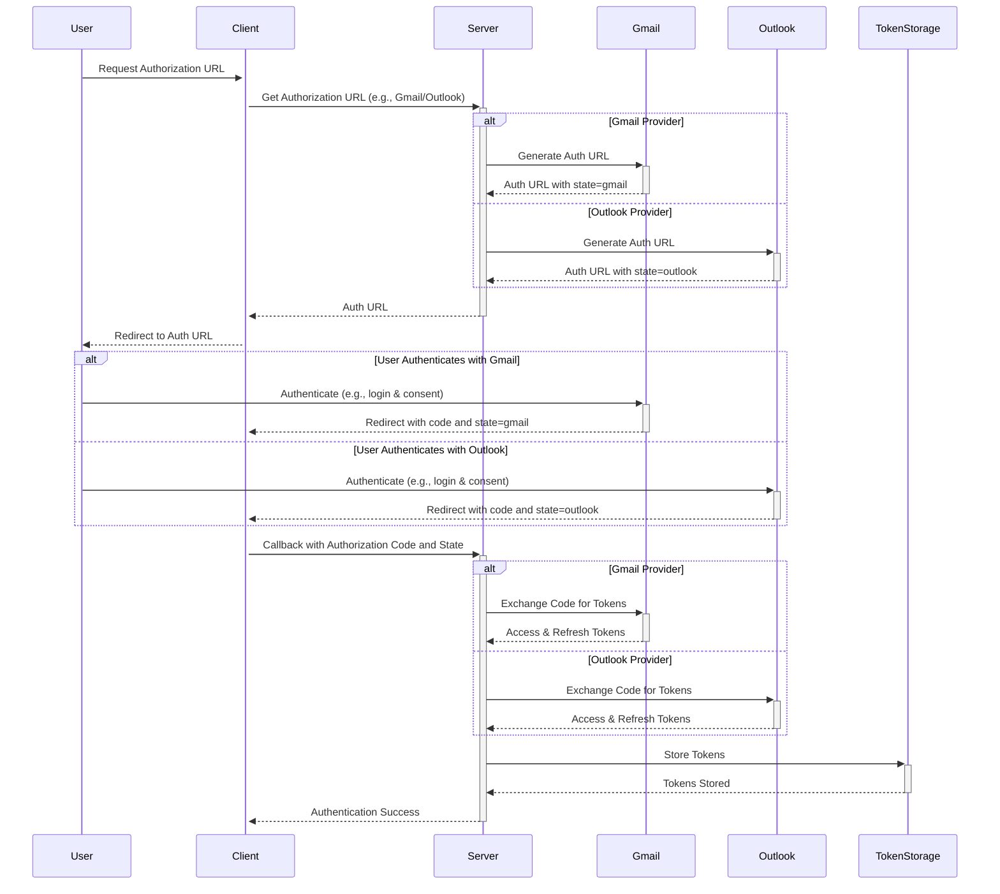
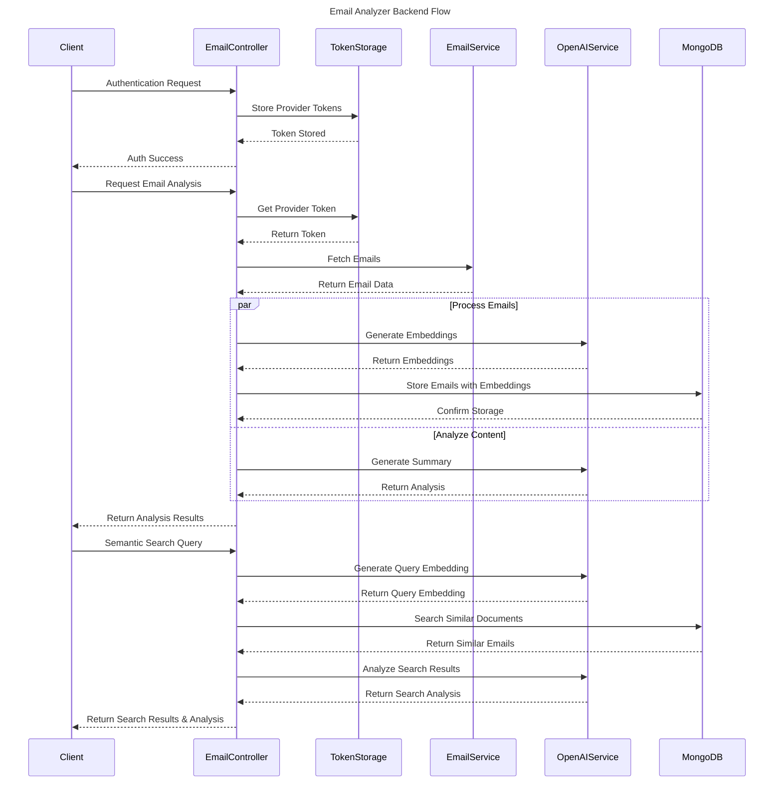

# Email Analyzer

Email Analyzer is a sophisticated email analysis application that leverages AI to provide deep insights into your email
communications. Built with .NET 8 and utilizing OpenAI's advanced language models, it offers semantic search, content
summarization, and intelligent analysis of email patterns.

## Project Structure

The solution is divided into three main projects:
- **EmailAnalyzer.Server**: Backend ASP.NET Core Web API service, deployed on Railway
- **EmailAnalyzer.Client**: Frontend .NET MAUI application
- **EmailAnalyzer.Shared**: Common models, interfaces and services shared between Client and Server

## Deployment
- Backend service is hosted on Railway platform
- MongoDB database is also hosted on Railway platform
- Frontend is distributed as a standalone MAUI application

## Features

- **Multi-Provider Support**: Seamless integration with Gmail and Outlook
- **OAuth2 Authentication**: Secure authentication flow for email providers
- **Semantic Search**: AI-powered search using embeddings
- **Smart Summarization**: Intelligent email content analysis and summarization
- **Vector Search**: Similarity-based email search using embeddings
- **Real-time Analysis**: Dynamic processing of email content
- **Cross-Platform UI**: Built with .NET MAUI for wide platform compatibility

## Architecture

The application follows a clean architecture pattern and consists of three main components:

### Backend (.NET 7 Web API)

- REST API endpoints for email operations
- Integration with OpenAI API
- MongoDB for storing emails and embeddings
- Token management and OAuth2 flow

#### Backend Flow for Authentication:



#### Backend Flow for Email Analysis:



### Frontend (.NET MAUI)

- Cross-platform UI implementation
- Responsive design
- Real-time data visualization
- Search interface

### Shared Library

- Common models and interfaces
- DTOs for data transfer
- Shared utilities and helpers

## Prerequisites

- .NET 8 SDK
- MongoDB
- OpenAI API Key
- Gmail/Outlook API credentials

## Configuration

1. Backend Configuration (`appsettings.json`):

```json
{
  "MongoDB": {
    "ConnectionString": "your_connection_string",
    "DatabaseName": "emailanalyzer"
  },
  "OpenAI": {
    "ApiKey": "your_api_key",
    "EmbeddingModel": "text-embedding-ada-002",
    "CompletionModel": "gpt-4"
  }
}
```

2. Email Provider Configuration:

```json
{
  "Gmail": {
    "ClientId": "your_client_id",
    "ClientSecret": "your_client_secret",
    "RedirectUri": "your_redirect_uri"
  },
  "Outlook": {
    "ClientId": "your_client_id",
    "ClientSecret": "your_client_secret",
    "RedirectUri": "your_redirect_uri"
  }
}
```

## Installation

1. Clone the repository:

```bash
git clone https://github.com/yourusername/email-analyzer.git
```

2. Install dependencies:

```bash
dotnet clean
dotnet restore
dotnet build
```

3. Configuration:
* Set up provider credentials in server configuration
* Configure OpenAI API key
* Set client API base URL

4. Run the application:

```bash
# Run MAUI client
cd EmailAnalyzer.Client
dotnet run
```

**Note: Since both backend and database are hosted on Railway, no local database setup is required.**

## API Endpoints

### Authentication
- `GET /api/auth/url/{provider}` - Get OAuth2 authorization URL
- `POST /api/auth/authenticate` - Handle OAuth2 authentication
- `GET /api/auth/callback` - OAuth2 callback handling
- `GET /api/auth/all-tokens` - Get all stored tokens
- `DELETE /api/auth/remove-token/{provider}` - Remove stored token

### Email Operations
- `GET /api/email/test/{provider}` - Test provider connection
- `POST /api/email/{provider}` - Fetch emails for date range
- `GET /api/email/available-range/{provider}` - Get available date range
- `POST /api/email/{provider}/analyze` - Analyze emails for date range
- `GET /api/email/{provider}/summaries` - Get email summaries
- `GET /api/email/{provider}/search` - Semantic search with AI analysis
- `GET /api/email/mongo` - Check MongoDB connection

### Health Checks
- `GET /api/health` - Basic service health check
- `GET /api/health/mongo` - MongoDB connection health check

## Development

### Building for Production

```bash
# Build backend
dotnet publish -c Release

# Build MAUI client
dotnet publish -f net8.0-windows10.0.19041.0
```

## Security

- OAuth2 flow for secure authentication
- Secure token storage
- API key protection
- Rate limiting
- Input validation

## Contributing

1. Fork the repository
2. Create a feature branch
3. Commit your changes
4. Push to the branch
5. Create a Pull Request

## License

This project is licensed under the MIT License - see the LICENSE.md file for details.

## Acknowledgments

- OpenAI for providing the AI models
- MongoDB for database capabilities
- Microsoft for .NET MAUI framework
